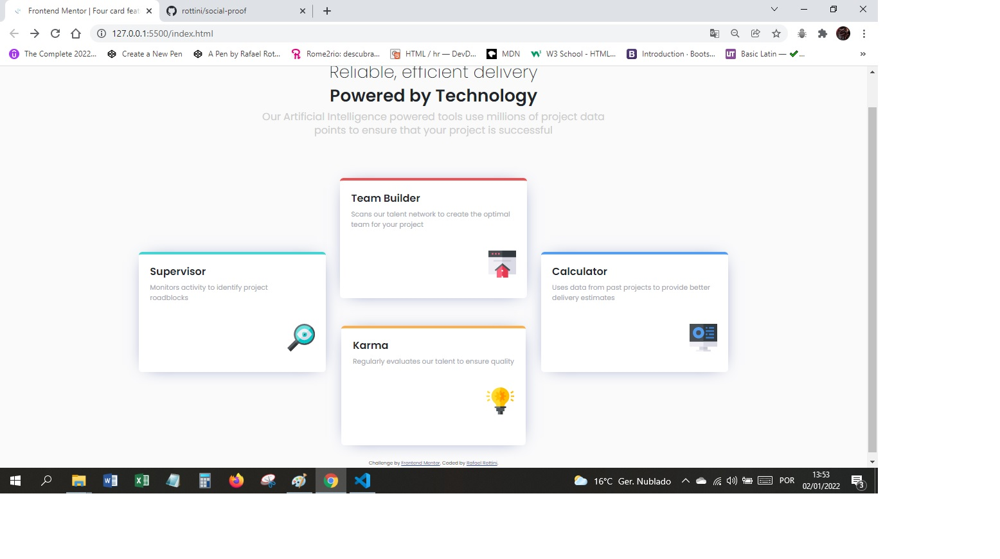

# Frontend Mentor - Four card feature section

## Overview

### The challenge

- Build out the project to the designs provided

### Screenshot

### Links

- Live Site URL: [github-pages](https://rottini.github.io/four-card-feature/)

## My process

### Built with

- Semantic HTML5 markup
- CSS custom properties

## Author

- Website - [Rafael](https://github.com/rottini)
- Frontend Mentor - [rottini](https://github.com/rottini/four-card-feature)
